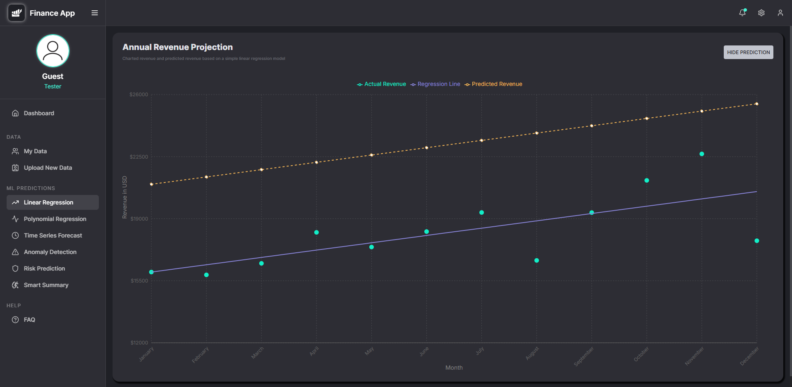
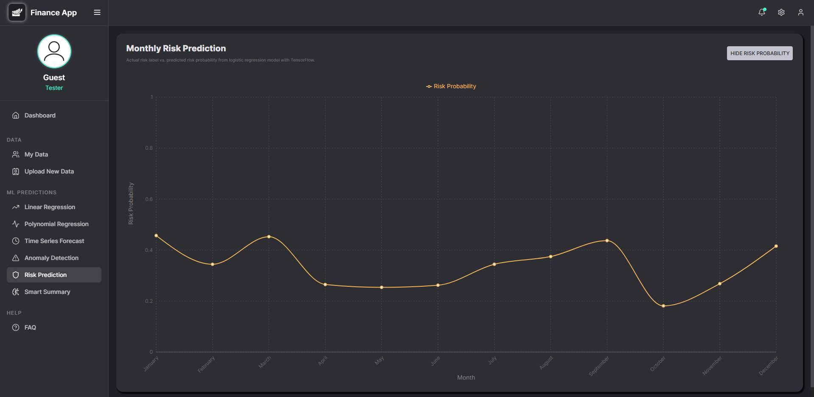

# Finance Application – AI-Powered Financial Dashboard

**Finance App** is a full-stack machine learning finance platform that empowers users to visualize, forecast, and analyze financial performance. From executive summaries to anomaly detection and predictive modeling, Finance App helps businesses navigate the uncertainties of the financial world.

🔗 **Website:** [https://finance-app-seven-ruby.vercel.app](https://finance-app-seven-ruby.vercel.app)  
🔗 **Video Demo:** [Watch the full demo on YouTube](https://youtu.be/JAuonCzHhUY)


## Complete App Screenshots

<details>
<summary>Click to view the full gallery of the Finance App's screens</summary>

<div style="display: flex; overflow-x: auto; gap: 12px; padding: 16px 0;">

  <!-- Landing Pages -->
  
  
  
  

  <!-- Core Dashboard -->
  
  
  

  <!-- ML Visualizations -->
  
  
  
  
  
  
  

</div>

</details>


---

## Overview

Finance App simplifies financial oversight by merging interactive data visualizations with cutting-edge ML models. Users can forecast revenue, analyze expenses, detect risks, and generate AI summaries — all from a seamless interface.

---

## Features

### Interactive Dashboard
- **Revenue & Expenses**: Compare monthly income vs. expenses.
- **Profit & Revenue**: Visualize margins across the year.
- **Bar & Line Charts**: Dynamic breakdowns by product, category, or time.
- **Product vs. Expense Scatter Plot**: Outlier detection & pricing analysis.
- **KPI Overview**: Real-time campaign and target metrics.

### Machine Learning Predictions
- **Linear Regression**: Predict revenue using straight-line trend.
- **Polynomial Regression**: Capture non-linear financial behavior.
- **Time Series Forecast (ARIMA)**: Predict future revenue using past seasonality.
- **Anomaly Detection**: Detect unusual revenue fluctuations using z-score.
- **Risk Prediction**: TensorFlow logistic regression model outputs risk probability.
- **Smart Summary**: LLaMA-powered executive-level summary generator for CROs and stakeholders.

### Data Management
- **Upload Custom Data**: Supports `.json` or `.txt` files (KPI, transaction, product).
- **Preview & Refresh**: Instant updates reflected on all ML screens.
- **Export to CSV**: Download cleaned structured datasets.

---

## Tech Stack

### Frontend
- **React (TypeScript)** – Component-driven architecture with typed safety
- **Redux Toolkit Query** – Handles API caching and data fetching for KPIs, Products, and Transactions
- **Material UI + TailwindCSS** – Hybrid design system for responsive and elegant UI
- **Recharts** – Visualization library for real-time, interactive charts
- **Vite** – Lightning-fast frontend build tool with Hot Module Reloading
- **Dark Mode + Responsive Grid** – Themed layout optimized for both desktop and mobile

### Backend
- **Node.js + Express** – RESTful API with modular route handlers for KPIs, Products, Transactions, Uploads, and GPT summaries
- **MongoDB (Mongoose ODM)** – Schema-driven NoSQL database with nested currency fields and advanced data modeling
- **TensorFlow.js** – In-browser ML for logistic regression–based risk prediction
- **Groq API (LLaMA 3)** – Ultra-fast language model used for generating executive-level summaries in real time
- **Helmet + Morgan + CORS** – Security, logging, and cross-origin middleware

### DevOps & Deployment
- **Fly.io** – Containerized Express backend with MongoDB integration
- **Vercel** – Static hosting and CI/CD for the React frontend
- **Docker** – Production-ready backend environment configuration (Dockerfile included)
- **.env Configuration** – Clean separation of secrets like MongoDB URIs and API keys


---

## ML Capabilities

| Feature               | Model Type              | Implementation         |
|----------------------|--------------------------|-------------------------|
| Linear Regression      | Linear Regression         | `regression.js`         |
| Polynomial Regression   | Polynomial Regression     | `regression.js`         |
| Time Series Forecast  | ARIMA-based seasonal model| Custom ARIMA logic      |
| Anomaly Detection     | Z-score method            | Custom implementation   |
| Risk Prediction       | Logistic Regression       | `TensorFlow.js`         |
| Executive Summary     | Natural Language Model    | LLaMA 3 via Groq API    |

---

## File Structure

```bash
client/
├── src/
│   ├── components/           # Reusable UI
│   ├── scenes/               # Route Views and user screens
│   ├── state/                # Redux Toolkit logic
│   └── App.tsx / theme.ts    # App root & theme configuration

server/
├── models/                  # Mongoose schemas
├── routes/                  # API endpoints (product, KPI, etc.)
├── data/                    # Seeded demo data
├── index.js                 # Server entry point
└── Dockerfile / .env        # Deployment configs
